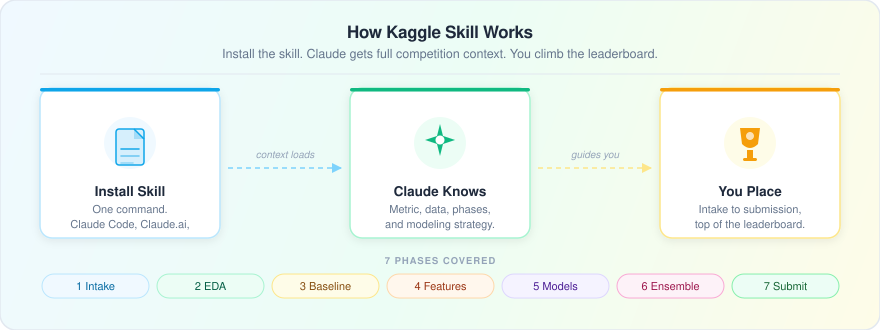

# Kaggle Skill


**Go from "I joined a Kaggle competition" to "top of the leaderboard" -- without losing your CV discipline.**

Most Kaggle competitors waste time on the wrong things: skipping EDA, not tracking experiments, and ensembling too late. This skill gives Claude the full competition context it needs to be a real co-pilot -- not just a code generator. Tell it about your competition. It guides you through every phase, one at a time.

Made by [Ian Too](https://iantoo.space)

---

## How It Works



---

## What You Get

Once installed, Claude walks you through every phase in order:

| Phase | What Happens |
|-------|-------------|
| 1. Intake | Paste a URL or text -- Claude reads the brief, extracts the metric, and builds a strategy |
| 2. EDA | Guided exploratory analysis with code, checklist, and a data quality report |
| 3. Baseline | Runnable baseline code tailored to your problem type -- scored immediately |
| 4. Feature Engineering | Ideas ranked by likely impact, implemented with CV-safe code |
| 5. Model Development | Multi-model experiments with an Optuna tuner and experiment log |
| 6. Ensemble | OOF-based blending and stacking with diversity checks |
| 7. Submission | Format verification, submission strategy, and final checklist |

---

## Installation

Pick the option that matches your setup:

### Claude Code (terminal)

```bash
claude skills install https://shipables.dev/skills/kaggle
```

### Claude.ai (browser)

1. Go to [claude.ai](https://claude.ai) and open any conversation
2. Click the **Skills** icon in the sidebar (or go to Settings > Skills)
3. Click **Add Skill** and paste this URL:
   ```
   https://shipables.dev/skills/kaggle
   ```
4. Click **Install** -- the skill will be available in all your conversations

### Cursor, Copilot, and other compatible agents

Most agents that support Agent Skills use the same install command:

```bash
npx @senso-ai/shipables install kaggle
```

Or check your agent's skill settings and paste the Shipables URL directly.

### Manual install (any agent)

1. Download `SKILL.md` from this repo
2. Place it in your project under `.claude/skills/kaggle/SKILL.md`
3. Restart your agent session -- it will pick up the skill automatically

---

## Usage

Just start talking:

> "I just joined a Kaggle competition, here's the link: [URL]"
> "Help me do EDA on this tabular dataset."
> "I have 3 models trained -- help me build an ensemble."

Claude will detect where you are and jump into the right phase.

## Files

```
kaggle-skill/
├── SKILL.md                    -- Main skill (all 7 phases)
├── how-it-works.svg            -- Diagram
├── README.md                   -- This file
└── references/
    ├── glossary.md             -- Plain-English Kaggle jargon guide
    ├── environment-setup.md    -- Python env, Jupyter, IDE, GPU setup + error table
    ├── eda-checklist.md        -- Full EDA checklist with code snippets
    └── model-templates.md      -- Starter code for tabular, NLP, CV, time series
```

## Requirements

- Works in Claude Code, Claude.ai, and any coding agent that supports skills
- Python environment with pandas, scikit-learn, lightgbm recommended
- No other dependencies

---

Made with love for data scientists. May your CV and LB scores always align.
